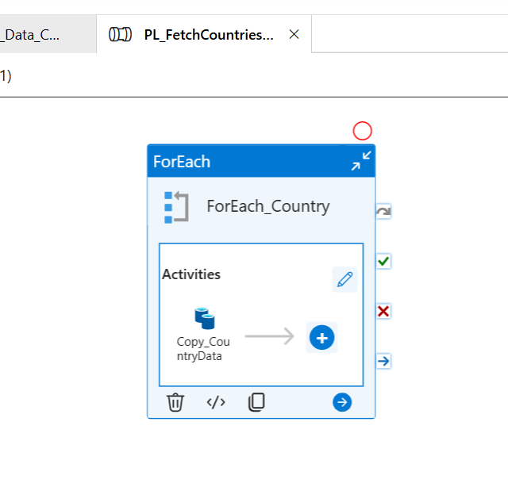
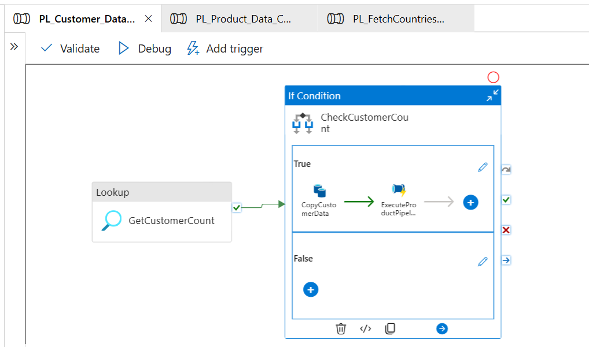
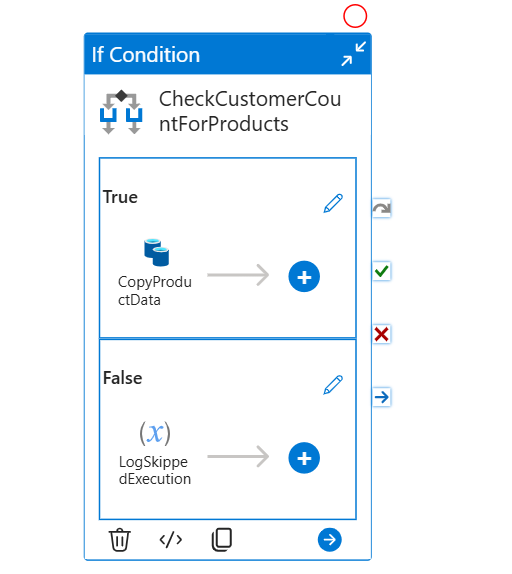
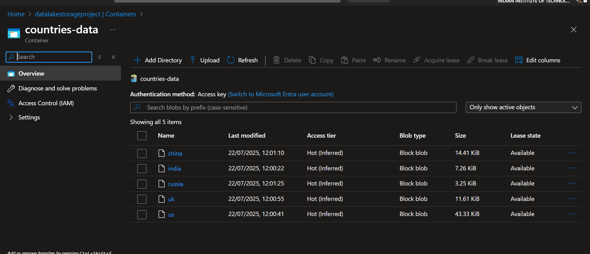
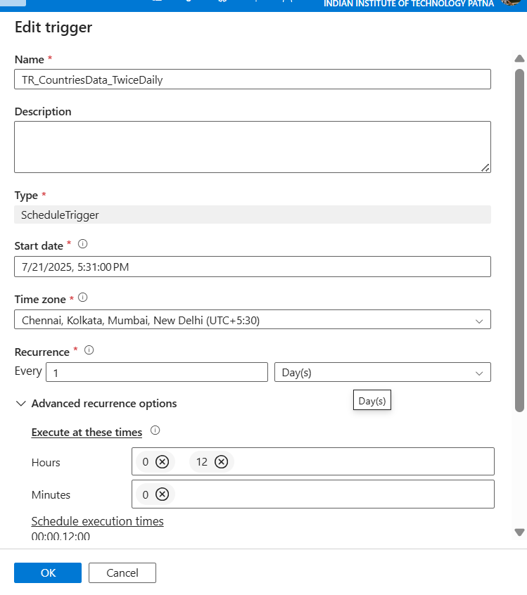
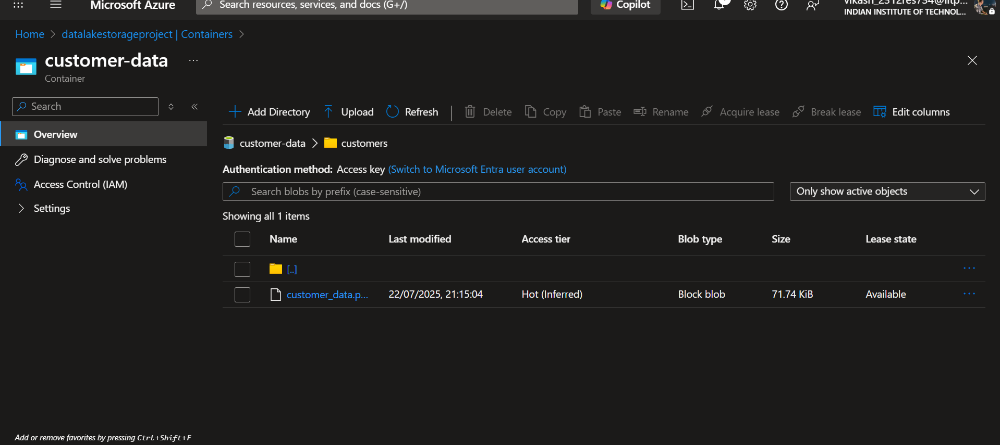
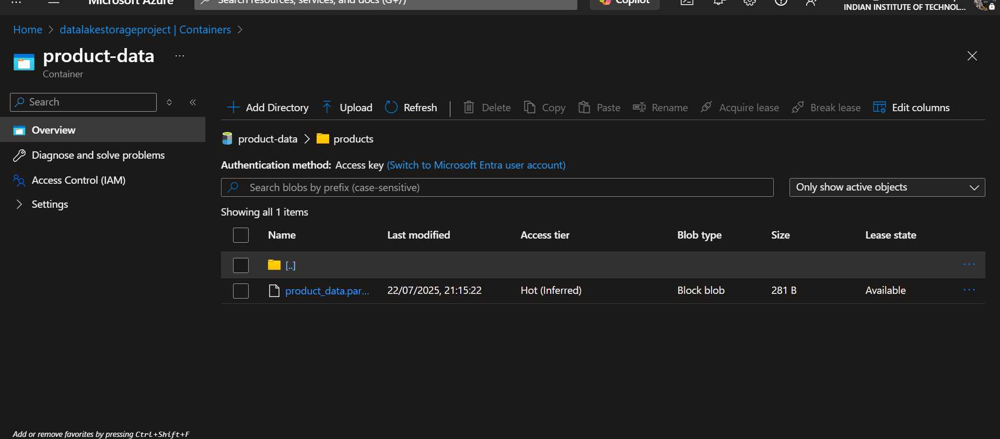
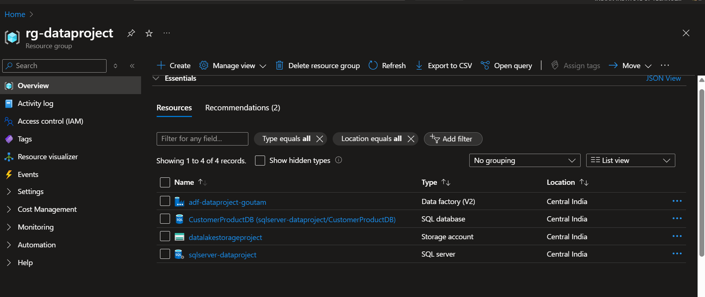
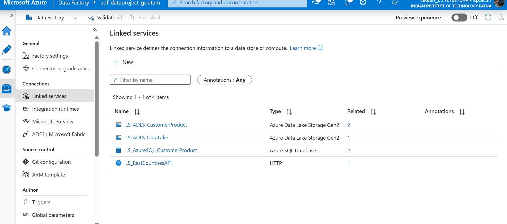

<h1> Genric Continuous data Ingestion from multiple streaming sources</h1>

<table>
  <tr>
    <td></td>
    <td></td>
    <td></td>
  </tr>
</table>

<p>A full Azure data engineering solution that exhibits continuous data input from a variety of streaming sources, including REST APIs and databases. This project uses Azure Data Factory to demonstrate automated data pipelines, scheduled data processing, and conditional data movement patterns.</p>

### 🗂️ Azure Data Pipeline Architecture
<pre>
┌─────────────────┐    ┌──────────────────┐    ┌────────────────────┐
│   REST API      │    │   Azure SQL      │    │  Azure Data Lake   │
│   (Countries)   │    │   Database       │    │  Storage Gen2      │
│                 │    │                  │    │                    │
│ • India         │    │ • Customers      │    │ • countries-data/  │
│ • US            │    │ • Products       │    │ • customer-data/   │
│ • UK            │    │                  │    │ • product-data/    │
│ • China         │    │                  │    │                    │
│ • Russia        │    │                  │    │                    │
└─────────────────┘    └──────────────────┘    └────────────────────┘
         │                       │                        │
         └───────────────────────┼────────────────────────┘
                                 │
                    ┌────────────▼──────────────┐
                    │    Azure Data Factory     │
                    │                           │
                    │ • Scheduled Triggers      │
                    │ • Conditional Logic       │
                    │ • Parameter Passing       │
                    │ • Error Handling          │
                    └───────────────────────────┘
</pre>

## 📌 Project Overview

This project implements a **Generic Continuous Data Ingestion** system that handles the following components:

- **API Data Ingestion**: Automated fetching from REST endpoints.
- **Scheduled Processing**: Time-based triggers for regular execution.
- **Database to Data Lake Migration**: Conditional data movement based on logic (e.g., record count).
- **Pipeline Orchestration**: Parent-child pipeline communication for modular execution.

## 📋 Task Overview  

### Task 1: Multi-Country REST API Integration

- **Source:** REST Countries API (`https://restcountries.com/v3.1/name/{country}`)
- **Target:** Azure Data Lake Storage (JSON files)
- **Countries:** India, US, UK, China, Russia
```powershell
@createArray('india','us','uk','china','russia')
```
- **Output:** Individual JSON files per country



### Task 2: Automated Scheduling

- **Trigger:** Time-based automation  
- **Frequency:** Twice daily
(12:00 AM and 12:00 PM IST) 



### Task 3: Conditional Database Migration

- **Source:**  Azure SQL Database (Customer & Product tables)
- **Target:** Azure Data Lake Storage (Parquet format)
- **Condition:**  Copy customer data only if record count > 500

```powershell
@greater(activity('GetCustomerCount').output.firstRow.customer_count, 500)
```
### Task 4: Pipeline Parameter Communication

- **Pattern:** Parent-child pipeline architecture
- **Parameter:** Customer record count
- **Logic:**  Child pipeline copies product data if customer count > 600

```powershell
@greater(pipeline().parameters.CustomerCount, 600)
```

- **Output:**
<table>
  <tr>
    <td></td>
    <td></td>
  </tr>
</table>

## 📁 Project Structure

```
cust-prod-data/
├── customer_data_final.csv         # Raw customer data
├── product_data_final.csv          # Raw product data
├── data.ipynb                      # Jupyter notebook  

dataset/
├── DS_ADLS_Customers.json          # ADLS Customer dataset definition
├── DS_ADLS_Products.json           # ADLS Product dataset definition
├── DS_CountryAPI.json              # Country API dataset
├── DS_CountryJSON_Output.json      # Output JSON for country API
├── DS_SQL_Customers.json           # SQL Customer dataset
├── DS_SQL_Products.json            # SQL Product dataset

factory/
└── adf-dataproject-goutam/         # ADF Factory definition

linkedService/
├── LS_ADLS_CustomerProd.json       # Linked Service for ADLS (Customer/Product)
├── LS_ADLS_DataLake.json           # Generic Data Lake Linked Service
├── LS_AzureSQL_Customers.json      # Linked Service for Azure SQL DB
├── LS_RestCountriesAPI.json        # Linked Service for REST API

output/
├── screenshot.png                  # Screenshot

pipeline/
├── PL_Customer_Data_Copy.json      # Pipeline for copying customer data
├── PL_FetchCountriesData.json      # Pipeline to fetch country data from API
├── PL_Product_Data_Copy.json       # Pipeline for copying product data

trigger/
├── TR_CountriesData_Trigger.json   # Trigger for country data pipeline
├── TR_CustomerProduct_Trigger.json # Trigger for customer/product data pipeline

cust_prod_table.sql                 # SQL script for customer/product table setup
publish_config.json                 # Configuration for ADF publish
README.md                           # Project documentation
```

## 🛠️ Technology Stack

| Component        | Technology                       | Purpose                                   |
|------------------|----------------------------------|-------------------------------------------|
| Orchestration    | Azure Data Factory               | Pipeline management and scheduling         |
| Data Storage     | Azure Data Lake Storage Gen2     | Scalable data lake for all formats         |
| Database         | Azure SQL Database               | Transactional data storage                 |
| Data Generation  | PySpark + Faker                  | Synthetic data creation                    |
| File Formats     | JSON, Parquet                    | Optimized for different use cases          |
| Authentication   | Azure AD                         | Secure service-to-service communication    |


## 🚀 Getting Started (Implementation Steps)

### Azure Resources Setup



### Phase 1: Data Preparation

- **Data Generation Folder:** `cust-prod-data/`

- Creates 800 customer records
- Creates 1000 product records
- Outputs CSV files for database import

- Database Setup
- Data upload to SQL Database using azure Data studio

### Phase 2: Azure Data Factory Configuration

#### 1. Create Linked Service



#### 2. Dataset Configuration


#### 3. Pipeline Development

- Countries API pipeline with ForEach loop
- Customer pipeline with conditional logic
- Product pipeline with parameter handling

### Phase 3: Scheduled Triggers

#### 3.1: Trigger Configuration

- Schedule trigger for countries API (twice daily)
- schedule triggers for database pipelines for customer and product data


#### 3.2: Parameter Setup

- Pipeline parameters for dynamic behavior
- Variable passing between parent-child pipelines

## 📊 Data Flow Details

### Countries API Pipeline Flow

REST API → HTTP Dataset → ForEach Activity → Copy Activity → ADLS JSON Files

### Database Migration Pipeline Flow

SQL Database → Lookup Activity → If Condition → Copy Activity → ADLS Parquet Files → Execute Pipeline → Child Pipeline


## 🏆 Why This Project Stands Out

-  **Complete Data Integration**: Ingests from REST APIs and Databases into ADLS using a fully Azure-native setup.
-  **Advanced Orchestration**: Uses parent-child pipelines with dynamic parameters and conditional logic.
-  **Real-World Use Cases**: Processes data based on thresholds (e.g., >500 records), handles multiple formats (JSON, Parquet), and supports automated scheduling.
-  **Technical Excellence**: Implements PySpark, Faker, robust error handling, and a clean data lake structure.
-  **Industry-Relevant Skills**: Demonstrates ETL/ELT, Azure Data Factory, ADLS Gen2, Azure SQL, CI/CD concepts, and environment configuration.

## 📈 What I Learned

Through this project, I gained:

-  Deep understanding of **Microsoft Azure** services, especially **Azure Data Factory** and its components.
-  Strong hands-on experience in **data engineering**, including **ETL pipelines**, data movement, and transformation.
-  Skills in **pipeline design**, **scheduling**, **parameterization**, and **monitoring**.
-  Practical knowledge of **real-world data workflows** and cloud-based architecture design.

- **Data Lake Architecture:** Modern data storage patterns

## 🙏 Acknowledgements

I would like to express my sincere gratitude to **CSI (Celebal Summer Internship)** for providing the opportunity to work on this comprehensive Data Engineering project. The guidance, mentorship, and hands-on exposure to real-world scenarios have significantly enriched my learning journey and practical understanding of modern data engineering solutions.

## Author
- **Name:** **Goutam Kumar Sah**